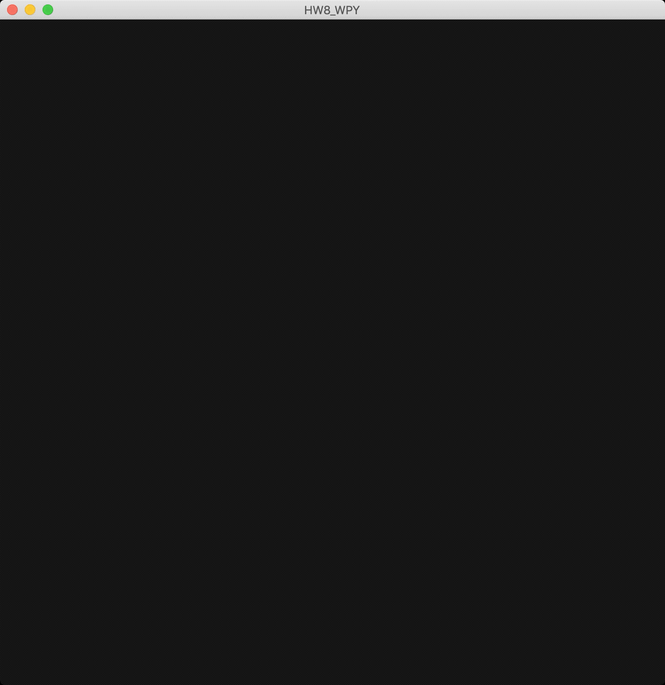

### 作业要求：

#### Basic:

1. 用户能通过左键点击添加Bezier曲线的控制点，右键点击则对当前添加的最后一个控制点进行消除 

2. 工具根据鼠标绘制的控制点实时更新Bezier曲线。 Hint: 大家可查询捕捉mouse移动和点击的函数方法 

#### Bonus: 

1. 动态呈现曲线生成过程 

#### 算法：

Bezier曲线可以用数学公式表示： $$ Q(t) = \sum_{i = 0}^{n}P_iB_{i, n}(t) $$，其中，Pi为第i个点的坐标，而Bi,n为伯恩斯坦函数，且符合： $$ t\in[0, 1] $$ 

伯恩斯坦函数： $$ B_{i, n}(t) = \frac{n!}{i!(n-i)!}t^i(1-t)^{n-i}, i=0,1,2,...,n $$ 


### 实验过程：

实现鼠标左键添加控制点，鼠标右键删除控制点，空格动态生成曲线。

#### 左右键处理：

```c
if (button == GLFW_MOUSE_BUTTON_LEFT && action == GLFW_PRESS) {
    double xpos, ypos;
    glfwGetCursorPos(window, &xpos, &ypos);
    p.push_back(glm::vec2((float(xpos) / float(SCR_WIDTH) * 2.0f) - 1, -((float(ypos) / float(SCR_HEIGHT) * 2.0f) - 1)));
}

if (button == GLFW_MOUSE_BUTTON_RIGHT && action == GLFW_PRESS) {

    p.pop_back();
}
```


#### 绘制曲线：

```c
vector<glm::vec2> point;
vector<glm::vec2> Points(point);
while (runningPoints.size() > 1)
{
    vector<glm::vec2> nextLevel;
    for (int i = 0; i < Points.size()-1; i++)
    {
        float Point[] = {
            Points[i].x, Points[i].y, 0.0f,
           	Points[i + 1].x, Points[i + 1].y, 0.0f
        };
        glBufferData(GL_ARRAY_BUFFER, 6 * sizeof(float), presPoint, GL_STATIC_DRAW);
        glDrawArrays(GL_LINES, 0, 2);
        glDrawArrays(GL_POINTS, 0, 2);
        
        glm::vec2 _Point;
        _Point.x = (1-running_t)*Points[i].x + (running_t) * Points[i + 1].x;
        _Point.y = (1-running_t)*Points[i].y + (running_t) * Points[i + 1].y;
        _Level.push_back(nextPoint);
    }
    Points = nextLevel;
}
```


#### 实验结果：

